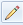
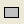
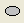
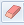

 

写在前面
----
	试看链接：[https://a20086115.github.io/draw/](https://a20086115.github.io/draw/)
	希望您能点个star 点个关注  点个收藏！
	有问题请issue！
代码实现
----
1.HTML内容
    
    上面是一个div 800*600，里面放了两张画布，相同大小，相互覆盖，因为画布默认是透明的，所以你在哪一个画布上绘画，你都可以在屏幕中看到。
    下面是四个ul列表，分别对应工具、颜色、粗细、清空。记得给每一个li选项添加一个class区分。
    以下是body里面的内容：
	

```
<div id="div1">
			<canvas id="c" width="800px" height="600px" style=""></canvas>
			<canvas id="c2" width="800px" height="600px"  ></canvas>
		</div>
		<div id="div2" >
			
			<ul>
				<li style="font-size: 13px;">工具：</li>
				<li id="qianbi" class="choice"></li>
				<li id="juxing"></li>
				<li id="yuanxing"></li>
				<li id="xiangpi"></li>
			</ul>
			<ul>
				<li style="font-size: 13px;">颜色：</li>
				<li class="black choice"></li>
				<li class="white" ></li>
				<li class="red"></li>
				<li class="yellow"></li>
				<li class="blue"></li>
			</ul>
			<ul>
				<li style="font-size: 13px;">粗细：</li>
				<li class="small" >细</li>
				<li class="normol choice" >正常</li>
				<li class="big">粗</li>
			</ul>
			<ul>
				<!--<li class="savedraw" ><button>保存</button></li>-->
				<li class="cleardraw" ><button>清空</button></li>
			</ul>
		</div>
```

2.CSS
	写完body里面的内容之后，接下来我们来设置一下样式。
	主要注意的内容有两点：
	1.两张画布要重叠放在一起，所以需要调整一下它们的位置
	2.ul下的li是块级元素，每一个会占一行，让它们在一行展示
	以下是css代码：
	

```
body
			{
				margin: 0px;
			}
			canvas
			{
				 position: absolute;
				 left: 0px;
				 right: 0px;
				 /*background-color: transparent  */
			}
			#div1
			{
				width: 800px;
				height: 600px;
				position: relative;
				border: 1px solid black;
			}
			#div2
			{
				width: 800px;
				height: 36px;
				border: 1px solid black;
				background-color:rgb(220,230,244) ;
			}
			ul
			{
				background-color: rgb(220,230,244);
				text-align: center;
				margin: 0;
				padding: 0;
				height: 30px;
				float: left;
				margin-left: 14px;
				margin-right: 14px;
			}
			ul>li
			{
				float: left;
				border: 1px solid gainsboro;
				width: 40px;
				line-height: 25px;			
				display: inline-block;
				height: inherit;
			}
			button
			{
				padding: 0px;
				
			}
			.red
			{
				background-color: red;
			}
			.black
			{
				background-color: black;
			}
			.white
			{
				background-color: white;
			}
			.blue
			{
				background-color: blue;
			}
			.yellow
			{
				background-color: yellow;
			}
			.choice
			{
				border: 3px solid gold;
			}
```

3.JS
	说一下我的实现思路，定义三个变量 style、mywidth、mycolor分别代表工具类型、粗细和颜色。所以首先写的是ul下li的点击事件，并且给每一个点击的li添加一个choice类（有一个黑色的粗边框），用来表示其被选状态；
	以下点击事件的代码：
	

```
var style = 0;
var mycolor = "black";
var mywidth = 2.5;
$(function(){
	//添加选中样式
	$("li").click(function(){
		$(".cleardraw").removeClass("choice");
		//如果点的是那几个小标题是没有反应的
		if ($(this).prop("className") == "firstli") {
			
		} else{
		//先把父元素下的其他元素的选中状态移除。
			$(this).parent().children().removeClass("choice");
			$(this).addClass("choice");
		}
		
	})
	$(".small").click(function(){
		mywidth = 1;
	})
	$(".normol").click(function(){
		mywidth = 2.5;
	})
	$(".big").click(function(){
		mywidth = 5;
	})
	$("#qianbi").click(function(){
		style=0;
	})
	$("#juxing").click(function(){
		style=1;
	})
	$("#yuanxing").click(function(){
		style=2;
	})
	$("#xiangpi").click(function(){
		style=3;
	})
	$(".red").click(function(){
		mycolor = "red";
	})
	$(".black").click(function(){
		mycolor = "black";
	})
	$(".white").click(function(){
		mycolor = "white";
	})
	$(".yellow").click(function(){
		mycolor = "yellow";
	})
	$(".blue").click(function(){
		mycolor = "blue";
	})
	$(".cleardraw").click(function(){
		ctx.clearRect(0,0,800,600);
	})
})
```

  这样就把click事件基本上写完了，下面来实现绘画功能，主要涉及到mousedown mousemove mouseup 三个事件
	说一下我的思路，鼠标点下的时候触发mousedown函数，switch一下style，判断是铅笔还是橡皮，还是矩形或者圆~
	先说铅笔，记录一下mousedown的坐标beginx和beginy，每一次鼠标move的时候，取一下这时候的event.pageX和event.pageY变量，然后在这两点之间画出线，并且修改下一次mousemove画线的起点应该是上一次的终点。也就是说，每次移动的之后都要beginx =event.pageX，beginy =event.pageY
注意：mousemove事件并不会随着你的鼠标抬起而clear，即使你把他写在了mousedown事件下，所以我用了一个lock，点击的时候lock = true 打开，mouseup的时候，lock = false锁上。后来发现更简单的方法，就是用 bind和unbind方法！

```
$("#div1").mousedown(function(event){
		beginx =event.pageX;
		beginy =event.pageY;
		console.log("我点下来的时候：",beginx,beginy);
		switch(style)
		{
			//铅笔状态
			case 0:
				console.log("我选的是铅笔");
				lock0 = true;
				//console.log("我点下来的时候：",beginx,beginy);
				$("#div1").bind('mousemove',function(event){		
					if(lock0)
					{			
						ctx.beginPath();
						ctx.moveTo(beginx,beginy);
						ctx.lineTo(event.pageX,event.pageY);
						ctx.strokeStyle = mycolor;
						ctx.lineWidth = mywidth;
						ctx.stroke();
						beginx =event.pageX;
						beginy =event.pageY;
			 	   }
				})
				break;
				}
		}
	})
```

橡皮的思路和铅笔一样，只不过要把颜色设置成白色固定！
	

```
	case 3:
				console.log("我选的是橡皮");
				lock3 = true;
				//console.log("我点下来的时候：",beginx,beginy);
				$("#div1").bind('mousemove',function(event){		
					if(lock3)
					{
					
						ctx.beginPath();
						ctx.moveTo(beginx,beginy);
						ctx.lineTo(event.pageX,event.pageY);
						ctx.strokeStyle = "white";
						ctx.lineWidth = mywidth*3;
						ctx.stroke();
						beginx =event.pageX;
						beginy =event.pageY;
			   		 }
				})
				break;
```
	然后是画矩形，这时候就用到了声明的第二个画布，我们可以把它看做成一个缓冲区，在mousemove下鼠标每次移动，先清空这个缓冲区，然后画到缓冲区里面一个矩形。mouseup的时候，也清空以下缓冲区，然后在第一张画布里根据位置声明一个一样的矩形。
	代码如下：
	

```
case 1:
				lock1 = true;
				console.log("画个矩形吧！");
				$("#div1").bind('mousemove',function(event){					
					if(lock1)
					{
						ctx2.clearRect(0,0,800,600); 
						xx=event.pageX-beginx;
						yy=event.pageY-beginy;
						ctx2.beginPath();
						ctx2.rect(beginx,beginy,xx,yy);
						ctx2.strokeStyle = mycolor;
						ctx2.lineWidth = mywidth;
						ctx2.stroke();
				    }
				})
				break;
```
画圆的话，和画矩形局相似了，我就不赘述了。
下面是画圆的代码：
```
				case 2 :
				lock2=true;
				console.log("画个圆吧 ！")
						   $("#div1").bind('mousemove',function(event){		
					if(lock2)
					{
						ctx2.clearRect(0,0,800,600); 					
						xx=event.pageX-beginx;
						yy=event.pageY-beginy;
						r = Math.sqrt(xx*xx+yy*yy)/2;
						centerx = (event.pageX+beginx)/2;
						centery = (event.pageY+beginy)/2;
						console.log(xx,yy,centerx,centery,r);
						ctx2.beginPath();
						ctx2.arc(centerx,centery,r,0,2*Math.PI,true);
						ctx2.strokeStyle = mycolor;
						ctx.lineWidth = mywidth;
						ctx2.stroke();
				    }
				})
				break;
```

最后把鼠标抬起的事件贴一下,下面是代码：

```
$("#div1").mouseup(function(){
		switch(style)
		{
			//铅笔状态
			case 0:
				
				break;
			//矩形状态
			case 1:
				ctx2.clearRect(0,0,800,600); 
				xx=event.pageX-beginx;
				yy=event.pageY-beginy;
				ctx.beginPath();
				ctx.rect(beginx,beginy,xx,yy);
				ctx.strokeStyle = mycolor;
				ctx.lineWidth = mywidth;
				ctx.stroke();
				break;
			//画圆状态
			case 2:
				ctx2.clearRect(0,0,800,600); 
				xx=event.pageX-beginx;
				yy=event.pageY-beginy;
				console.log(event.pageX,event.pageY);
				r = Math.sqrt(xx*xx+yy*yy)/2;
				centerx = (event.pageX+beginx)/2;
				centery = (event.pageY+beginy)/2;
				console.log(xx,yy,centerx,centery,r);
				ctx.beginPath();
				ctx.arc(centerx,centery,r,0,2*Math.PI,true);
				ctx.strokeStyle = mycolor;
				ctx.lineWidth = mywidth;
				ctx.stroke();
				break;
			case 3:
				
				break;
				
		}
	$("#div1").unbind("mousemove");
	//lock0=false;
	//lock1=false;
	//	lock2=false;
	//	lock3=false;
	});
```
